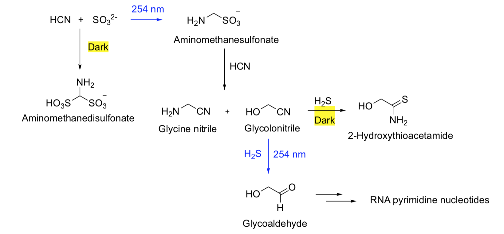

# Active Galactic Nuclei: Boon or Bane for Biota?

Manasvi Lingam, Idan Ginsburg, Shmuel Bialy, 2019, arXiv

## Positive

- Explicate some of the positive consequences associated with AGNs (during the quasar phase) for the synthesis of prebiotic compounds (precursors of RNA)
- enabling photosynthesis on free-floating planets up to a certain distance from the SMBH

## Negative

- Some crucial factors that not considered explicitly before

## Ultraviolet Fluxes for Prebiotic Chemistry

- Neglect absorption of the dusty torus surrounding the AGN and dust and gas in the cores of galaxies

### Critical galactic distance

- Bolometric luminosity $L$
  $$
  L \approx 1.3 \times 10^{38} \operatorname{ergs}^{-1} \varepsilon_{\mathrm{Edd}}\left(\frac{M_{B H}}{M_{\odot}}\right)
  $$

- Consider the fraction $\eta_{OL}​$ (in the wavelength)

  - cyanosulfidic metabolism (related to cyanide and sulfide, i.e. $\ce{(H)CN,(H2)S}​$)
  - a reaction network that yields the **precursors of amino acids, nucleic acids, and lipids** from a common set of reactants under potentially plausible geochemical conditions
  - $200-280\text{ nm}​$

- Energy flux $\Psi_{OL}​$ (isotropic assumption)
  $$
  \Psi_{O L} \approx \frac{\eta_{O L} L}{4 \pi d^{2}}\approx \frac{2.1\times10^{-2}L}{4 \pi d^{2}}
  $$

- Photon number flux threshold

  Consider the reaction between $\ce{HCN}​$ and $\ce{SO3^2-}​$ to finally form RNA pyrimidine

  

  - There is a threshold for the light chemistry to dominate, otherwise the yield of pyrimidine will be low

  - For $\ce{SO3^2-}$
    $$
    F_{\lambda}=(6.8 \pm 3.6) \times 10^{9} \mathrm{cm}^{-2} \mathrm{s}^{-1} \mathrm{A}^{-1}
    $$
    The total number density flux is $5.44\times10^{12}\text { photons } \mathrm{cm}^{-2} \mathrm{s}^{-1}$

    By narrow band approximation, $\overline{E}_{U V}=8.5 \times 10^{-12} \text { erg }$
    $$
    \Psi_{c} \approx 46.3 \text { erg } \mathrm{cm}^{-2} \mathrm{s}^{-1}
    $$

- Corresponding distance
  $$
  d_{O} \approx 2.2 \times 10^{-2} \operatorname{pc} \varepsilon_{\mathrm{Edd}}^{1 / 2} \sqrt{\frac{M_{B H}}{M_{\odot}}}\approx 44\text{ pc}
  $$
  for Eddington accretion rate of Sgr A* - too small for MW

  - high stellar density - prebiotic compounds exchange
  - more massive SMBHs
  - compact dwarf galaxies - a sizable fraction of stars lie within $d\le d_O$

### Timescales

- **Salpeter time** $t_S$ 

  over which the mass of the SMBH is approximately doubled under the assumption of Eddington-limited accretion
  $$
  t_{S} \approx 4.5 \times 10^{7} \mathrm{yrs}\left(\frac{1}{\varepsilon_{\mathrm{Edd}}\left(1-\epsilon_{B H}\right)}\right)\left(\frac{\epsilon_{B H}}{0.1}\right)\sim10^8\mathrm{yrs}
  $$
  where $\epsilon_{{BH}}$ is the radiative efficiency $\sim0.1$

- Life on earth originated within $8\times10^{8}\text{yrs}$ after the earth become habitable (lower bound $\sim2\times10^8\text{yrs}$)

- the timescale of AGN activity might suffice to initiate UV-driven prebiotic chemistry and pave the way for abiogenesis on some planets resembling Hadean Earth

## Powering Photosynthesis

- **Photosynthesis**

  the biological synthesis of organic compounds from inorganic carbon sources via oxygenic photosynthesis that is usually accompanied by the release of $\ce{O2}​$ as a product

- Free-floating planets

  - No radiation from host stars
  - May possess temperatures and conditions amenable to habitability
  - $\sim2\times10^3$ per main sequence star (size between Moon and Jupiter, quasar microlensing) -> $10^{11}$ free-floating objects within $d\sim100\text{ pc}$

### Critical galactic distance

- Photon flux
  $$
  \Psi_{P A R} \approx \frac{\eta_{P A R} L}{4 \pi d^{2}}
  $$
  $\eta_{PAR}$ is the fraction of radiation suitable for photosynthesis

  - $400-1000\text{ nm}$
    - Lower bound - inhabitation of photosynthesis by UV radiation
    - Upper bound - Energy to split a water molecule
  - $\eta_{PAR}\approx5.7\times10^{-2}​$ (sometimes high as 0.1)

- $\Psi_{0} \sim 2.1 \text { erg } \mathrm{cm}^{-2} \mathrm{s}^{-1}$

  - $\overline{E}_{P A R} \approx3.5 \times 10^{-12} \text { erg }​$
  - Number flux $\sim 6 \times 10^{11} \text { photons } \mathrm{cm}^{-2}\mathrm{s}^{-1}​$

- Critical distance
  $$
  d_{P} \approx 0.17\ \mathrm{pc}\ \varepsilon_{\mathrm{Edd}}^{1 / 2} \sqrt{\frac{M_{B H}}{M_{\odot}}}\approx0.34\ \mathrm{kpc}
  $$

  - Low productivity at low light levels
  - Other species are needed, such as $\ce{PO4^3-}$ and water

### Timescales

- Photosynthesis evolution timescale on earth - $10^8-10^9\text{ yrs}$ after the origin of life
- May be able to permit the evolution of anoxygenic photosynthesis at the minimum, but not to maintain it

## Harmful Effects of Ultraviolet Radiation on Biospheres

- Inhibition of photosynthesis
- The damage of DNA and other biomolecules

### Critical galactic distance

- UV-A (315-400 nm), UV-B (280-315 nm) and UV-C (122-280 nm)

- Fluxes
  $$
  \Psi_{j} \approx \frac{\eta_{j} L}{4 \pi d^{2}},\ j \in\{\mathrm{A}, \mathrm{B}, \mathrm{C}\}
  $$

  $$
  \eta_{A} \approx 1.5 \times 10^{-2},\ \eta_{B} \approx 7.3 \times 10^{-3}, \ \eta_{C} \approx 5.2 \times 10^{-2}
  $$

  UV-A can be excluded

- Earth (8 kpc away) - several orders of magnitude lower than the solar UV flux at TOA

- Other worlds

  - Ancient Earth at $\sim$ 3.9 Ga
    - High UV-C flux
    - Extreme UV radiation $871 \text { erg } \mathrm{cm}^{-2}\mathrm{s}^{-1}​$
    - Evidence of simple forms of life
  - Modern Earth (with ozone layer)
    - UV-B flux dominates
    - Complex biota adapted to live in temperate environments

- Critical TOA UV flux

  - TOA UV-B flux contributed by AGN equals the TOA UV-B flux arising from the sun
  - Modern Earth - $8.6 \times 10^{3} \text { erg } \mathrm{cm}^{-2} \mathrm{s}^{-1}​$
  - Earth-like planets in the HZ of late M-dwarfs - a factor of $\sim4\times10^{-3}​$ relative to earth

- Critical distance
  $$
  d_{B} \approx 9.6 \times 10^{-4} \mathrm{pc}\ \varepsilon_{\mathrm{Edd}}^{1 / 2} \sqrt{\frac{M_{B H}}{M_{\odot}}},\ \text{or }d_{B} \approx 1.5 \times 10^{-2} \operatorname{pc} \varepsilon_{\mathrm{Edd}}^{1 / 2} \sqrt{\frac{M_{B H}}{M_{\odot}}}
  $$
  2 pc / 30 pc

  - Obviously too small, and even for $d\sim d_B​$, UV radiation will not necessarily cause extinction-level events
  - Can be very large for more massive SMBHs ($d_{B} \lesssim 0.2-3\ \mathrm{kpc}$)

### X-rays and Gamma rays

- Mainly absorbed by earth-like atmospheres and merely reach the surface
  - Atmospheric escape
  - Photolysis of atmospheric $\ce{H2O}​$ leading to the depletion of oceans
  - Chemical impacts
  - Ozone depletion

## Conclusions

- There may be UV radiation induced prebiotic molecule syntheses or photosyntheses within 1 kpc, while no extinction events should occur
- Two types of galaxies that both positive and negative effects are more important
  - Anomalously large SMBHs that are orders of magnitude
    more massive than Sagittarius A*
  - Compact dwarf galaxies, high stellar density
- Not likely to find signatures of past electromagnetic radiations from AGN activities
  - No significant effects on biosphere
  - high-energy electromagnetic radiation tends to leave few direct traces in the geological record
- Future work
  - Galactic Cosmic Ray

