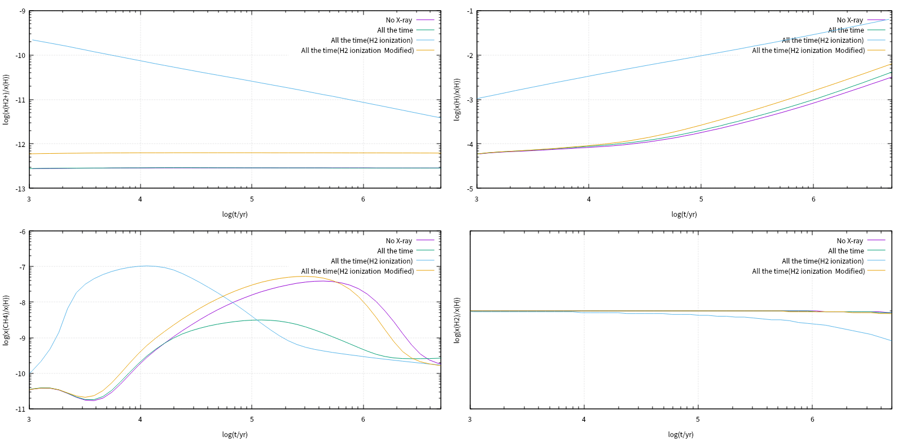
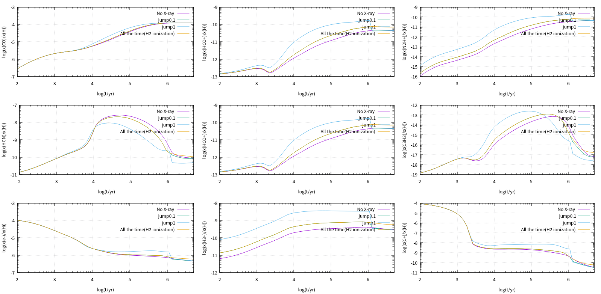
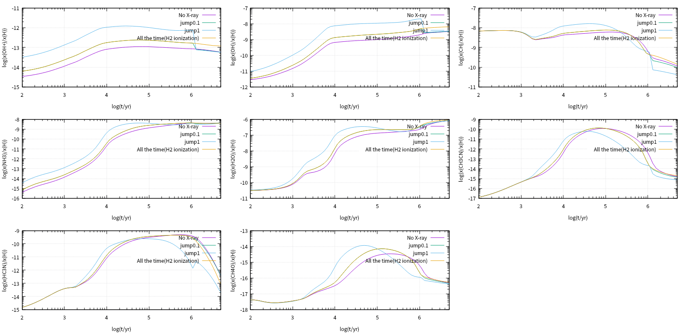
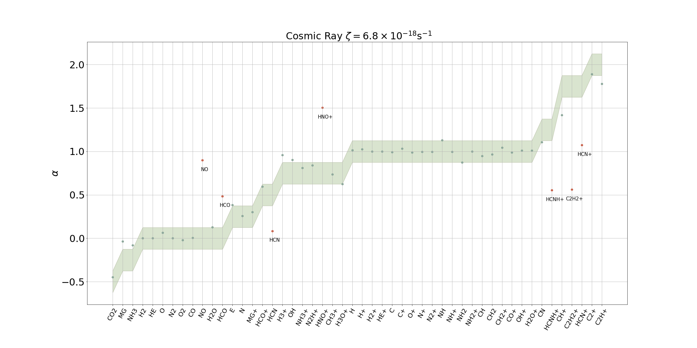
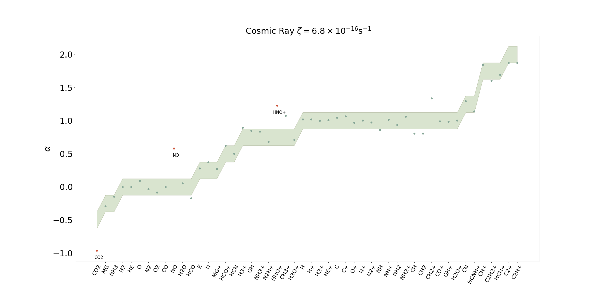
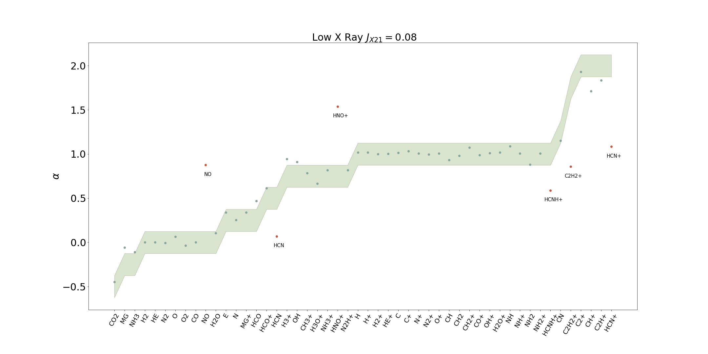
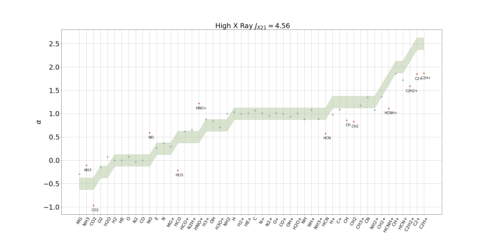
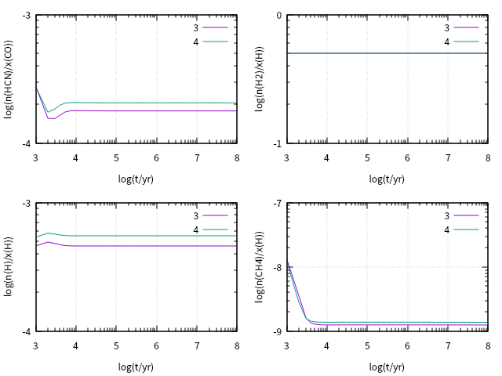

# The Weekly Progress
**Since Nov. 10, 2018**

In the autumn semester, hopefully I'll record my progress every Thursday morning

## Before Nov. 10, 2018
1. Understand why X-ray cause profound effects to ISM

2. Aquire the X-ray spectra emitted the SMBH in the center of Milky Way Galaxy several mys ago  

3. Decide to focus on a cold dense cloud 8 kpc from the SMBH, thus fixing the flux

4. Figure out how KROME works, especially its X-ray module (details on <https://github.com/slowdivePTG/X-ray-chemistry/tree/master>)

5. Be able to calculate primary X-ray ionizations according to a X-ray spectra and the cross sections of certain species.
   $$
   \zeta_k^p=\int_{E_{min}}^{E_{max}}\frac{F_X(E)}{E}\sigma_k(E)\text{d}E
   $$

   $$
   F_X(E):\text{ erg}\cdot\text{ cm}^{-2}\cdot\text{ s}^{-1}
   $$

6. Learn about the cosmic ray ionization


## Nov. 10, 2018
1. Trace the most important reactions using the Jacobian Matrix pd(i,j)
   $$
   pd(i,j)=\frac{\partial}{\partial n(j)}\left(\frac{\text{d}n(i)}{\text{d}t}\right)
   $$

   $$
   \left(\frac{\text{d}n(i)}{\text{d}t}\right)_j=n(j)\cdot pd(i,j)
   $$

   In `krome_oed.f90`, the `jex` function calculate the Jacobian Matrix.

2. Test a simple model but consider a mixture of H/He rather than $\text{H}_2/\text{He}$. $J_{X21}=0.1$ for 1 mys then turn off the X-ray radiation. Plot the abundance of $\text{CH}_4$ with time.

> For this molecular cloud test we choose the **osu_01_2007** network and the initial conditions proposed by *Wakelam & Herbst (2008)*: a constant temperature of $\text{T} = 10\text{ K}$, $\ce{H2}$ density of $10^4\text{ cm}^{−3}$, cosmic rays ionization rate of $1.3 \times 10^{−17}\text{ s}^{−1}$, and a visual extinction of 10.
> The initial conditions of the species are listed in Table 7 and correspond to the EA2 model of *Wakelam & Herbst (2008)*, an high-metal environment observed in the diffuse cloud $\zeta$ *Ophiuchi*

```fortran
  Tgas = 1d1 !gas temperature (K)
  xH = 2d4 !Hydrogen density

  !user commons for opacity and CR rate
  call krome_set_user_av(1d1) !opacity Av (#)E11.3,
  call krome_set_user_crate(1.3d-17) !CR rate (1/s)
  call krome_set_user_gas_dust_ratio(7.57d11) !gas/dust

  call krome_init()
  j21xs = 0d0
  call krome_set_J21xray(j21xs)
  print *,"J21 Xray = ",j21xs

  x(:) = 1.d-20
  !initial densities (model EA2 Wakelam+Herbst 2008)
  x(KROME_idx_H2)  = 0.5d0   * xH !In this case we actually use  x(KROME_idx_H)  = 0.5d0   * xH, which is not true
  x(KROME_idx_He)  = 9d-2   * xH
  x(KROME_idx_N)   = 7.6d-5  * xH
  x(KROME_idx_O)   = 2.56d-4 * xH
  x(KROME_idx_Cj)  = 1.2d-4  * xH
  x(KROME_idx_Sj)  = 1.5d-5  * xH
  x(KROME_idx_Sij) = 1.7d-6  * xH
  x(KROME_idx_Fej) = 2d-7   * xH
  x(KROME_idx_Naj) = 2d-7   * xH
  x(KROME_idx_Mgj) = 2.4d-6  * xH
  x(KROME_idx_Clj) = 1.8d-7  * xH
  x(KROME_idx_Pj)  = 1.17d-7 * xH
  x(KROME_idx_Fj)  = 1.8d-8  * xH

  !calculate elctrons (neutral cloud)
  x(KROME_idx_e) = krome_get_electrons(x(:))
```


## Nov. 15, 2018 

1. (From Prof. Du) The secondary ionization rate of molecular hydrogen can be approximately considered as 2 hydrogen atoms.

   > Related readings:
   >
   > *X-ray chemistry in the envelopes around young stellar objects*, Stäuber 2005
   >
   > *X-Ray--irradiated Molecular Gas. I. Physical Processes and General Results*, Maloney 1996

   According to Maloney 1996, the main process in the X-ray (secondary) ionization of $\ce{H2}$ is:
   $$
   \ce{H2 + e- -> H2+ + 2e-}
   $$
   We can assume the rate coefficient is twice the ionization rates of $\ce{H}$, and thus include it in the network.


   > **INCLUDE** means when calculating the secondary ionization rates, we take the abundance of $\ce{H}$ :
$$
n_t(\ce{H})=n(\ce{H})+2n(\ce{H2})
$$


​	The modification of Fortran code in `krome_subs.f90` is shown here

   ```fortran
   !H2 -> H2+ + E
   k(38) = rateEvaluateOnce(38)
   
   !H -> H+ + E
   k(4430) = small + ((ratexH &
       * (1d0+phiH) + n(idx_He)&
       /(n(idx_H)+2*n(idx_H2)+1d-40) * ratexHe * phiH)&
       * J21xray)
       
   k(38) = k(38) + 2*k(4430)
   
   !HE -> HE+ + E
   k(4431) = small + ((ratexHe &
       * (1d0+phiHe) + (n(idx_H)+2*n(idx_H2))&
       /(n(idx_He)+1d-40) * ratexH * phiHe)&
       * J21xray)
   
   ```


​	Some results are:




​	Obviously the ionization of $\ce{H2}$ becomes more significant, and the profile of $\ce{CH4}$ changes a lot. If we don’t take $n_t(\ce{H})$ the effect is even more profound.

- *(NOT AT PRESENT)* For heavier atoms or other molecules, we can apply the approximation with the energy $E$ fixed, neglecting the dependence of the cross sections on energy:

$$
\zeta_i=\zeta _ { \mathrm { H } _ { 2 } }\frac{\sigma_i(E)}{\sigma_{\mathrm { H } _ { 2 }}(E)}
$$

2. Species observants most interested in:

  > 经常观测的分子包括$\ce{CO、HCO+、N2H+、HCN}$、各种碳氢化合物$\ce{C2H、C3H3}$等等。可以关注一下代表了电离度的电子丰度$x_e$，以及$\ce{H3+、C+、OH+、H2O+}$等离子的丰度；$\ce{OH、CH、NH3、H2O}$等也可以看看。还可以看更复杂一些的$\ce{CH3CN、CH3OH}$等

  $x_e$ is important because it decides the chemical composition and whether the heating process is sufficient


3. The simple $\ce{H/He}$ model used before:

   - Abundance of $\ce{CH4}$ too low
   - Not enough time to form $\ce{H2}$
   - Does not include $\ce{H2}$ formation on **grains**

   Therefore it is not reasonable enough, and I shall focus on the new $\ce{H2/He}$ model to see what will happen if I turn off the X-ray after 1 mys.

   Without $\ce{H2}$ formation on **grains**, there seems no jump in the abundance of $\ce{CH4}$ , which is shown in the plot.


## Nov. 22, 2018

1. More details on secondary ionization

   The secondary ionization rate for $\ce{H}$ ( Stäuber 2005, Maloney 1996, ): 
   $$
   \zeta_H^{(2)}=\int_{E_{min}}^{E_{max}}\frac{F(E)}{E}N_{sec}(E,x_e)\sigma(E)\text{d}E\\
   N_{sec}(E,x_e)=\frac{E-E_{th}}{W(E)}\approx\frac{E}{W(E)}
   $$
   $N_{sec}(E)$ is the number of secondary **ionizations** per unit energy produced by primary photoelectrons$W(E)$ is the mean energy expended to produce an ion pair through rapid electron process

   #### A BIG MISTAKE HERE LAST WEEK!

   $N_{sec}(E)$ is not the number of secondary electrons but the number of ion pairs produced by a secondary electron. **WE DON’T COUNT ELECTRONS HERE! **

   ### More comments on the formula

   - $W(E)$ is nearly independent of $E$ if $E>200\text{ eV}$ , which is easy to satisfied in our case

   - $N_{sec}(E,x_e)$ is dependent on $x_e$. When $x_e>1\%$ , the energy in photoelectrons will be mainly lost to Coulomb Interaction with ambient thermal electrons.  In our case, $n_e/n_\ce{H}<10^{-4}$ . For weakly ionized gases,  $\approx40\%$ of the primary electron energy will be used for ionization (Krolik 1983, Shull 1985) , then for a secondary electron with energy $1\text{ keV}$ , the number of $\ce{H}$ it can ionize is:
     $$
     N=\frac{0.40\times1\text{ keV}}{13.6\text{ eV}}\approx30
     $$
     More precise calculation ( Glassgold & Langer 1973, Dalgarno 1999, Glassgold 2012 ) shows that in $\ce{H2 + He}$ neutral gas, $47\%$ of energy goes to ionization, $47\%$ in $\ce{H2}$ and $\ce{He}$ excitation, the rest goes for heating. $N_{sec}(E)\approx27$ and thus we can take $W(E)\approx37\text{ eV}$.

   ### The formula I actually use

   $$
   \zeta _ { \mathrm { tot } } ^ { i } = \zeta _ { \mathrm { p } } ^ { i } + \sum _ { j = \mathrm { H } , \mathrm { He } } \frac { n _ { j } } { n _ { i } } \zeta _ { \mathrm { p } } ^ { j } \left\langle \phi ^ { i } \right\rangle
   $$

   - The numbers of secondary ionization of $\ce{H}$ and $\ce{He}$ per primary ionization are taken from Shull 1985
     $$
     \begin{aligned} \phi ^ { \mathrm { H } } \left( E , x _ { \mathrm { e } } \right) & = \left( \frac { E } { 13.6 \mathrm { eV } } - 1 \right) 0.3908 \left( 1 - x _ { \mathrm { e } } ^ { 0.4092 } \right) ^ { 1.7592 } \\ \phi ^ { \mathrm { He } } \left( E , x _ { \mathrm { e } } \right) & = \left( \frac { E } { 24.6 \mathrm { eV } } - 1 \right) 0.0554 \left( 1 - x _ { \mathrm { e } } ^ { 0.4014 } \right) ^ { 1.660 } \end{aligned}
     $$

   - Can be rewritten like this:
     $$
     \zeta_{tot}^\ce{H}=\zeta_p^\ce{H}(1+\langle\phi^\ce{H}\rangle)+\zeta_p^\ce{He}\frac{n_\ce{He}}{n_\ce{H}}\langle\phi^\ce{H}\rangle\\
     \zeta_{tot}^\ce{He}=\zeta_p^\ce{He}(1+\langle\phi^\ce{He}\rangle)+\zeta_p^\ce{H}\frac{n_\ce{H}}{n_\ce{He}}\langle\phi^\ce{He}\rangle
     $$
     which average $\phi$ over the X-ray spectrum $F(E)$

      

2. Test all the species listed last week

   

   


## Nov. 29, 2018

1. Recalculate the ionization rate using the primal formula
   $$
   \zeta_{tot}^\ce{H}=\zeta_p^\ce{H}+\frac{n_\ce{He}}{n_\ce{H}}\int_{E_{min}}^{E_{max}}\frac{F(E)}{E}e^{-\tau(E)}\phi^\ce{H}\sigma_{\ce{He}}(E)\text{d}E+\int_{E_{min}}^{E_{max}}\frac{F(E)}{E}e^{-\tau(E)}\phi^\ce{H}\sigma_{\ce{H}}(E)\text{d}E
   $$
   rather than the simplified one
   $$
   \zeta_{tot}^\ce{H}=\zeta_p^\ce{H}(1+\langle\phi^\ce{H}\rangle)+\zeta_p^\ce{He}\frac{n_\ce{He}}{n_\ce{H}}\langle\phi^\ce{H}\rangle
   $$
   and compare the results.

   When we set $n_\ce{H}=2\times10^4\text{ cm}^{-3},n_\ce{He}=2\times10^3\text{ cm}^{-3},J_{X21}=0.1,T=160\text{ K}$ , we get
   $$
   \zeta_\ce{H}=4.09\times10^{-18}\text{ s}^{-1},\quad\zeta_\ce{He}=3.61\times10^{-18}\text{ s}^{-1}\quad(\text{Primal})\\
   \zeta_\ce{H'}=7.23\times10^{-18}\text{ s}^{-1},\quad\zeta_\ce{He'}=6.07\times10^{-18}\text{ s}^{-1}\quad(\text{Simplified})\\
   \frac{\zeta_\ce{H}}{\zeta_\ce{H'}}\approx\frac{\zeta_\ce{He}}{\zeta_\ce{He'}}\approx0.56
   $$

   Since we take $E_{min}=2\text{ keV},E_{max}=10\text{ keV}$ , and in our case, $F(E)\propto E^{-1.5}$, $ \sigma(E)\propto E^{-3}$ , $\phi(E,x_e)\propto E$, $e^{-\tau(E)}\sim1$, we have
   $$
   \zeta^{(2)}=\int_{E_{min}}^{E_{max}}\frac{F(E)}{E}\phi(E)\sigma(E)\text{d}E=F_0\phi_0\sigma_0\cdot\int_{2}^{10}E^{-4.5}\text{d}E=\frac{2^{-3.5}-10^{-3.5}}{3.5}F_0\phi_0\sigma_0\approx0.025F_0\phi_0\sigma_0\\
   $$
   and
   $$
   \int_{E_{min}}^{E_{max}}\frac{F(E)}{E}\sigma(E)\text{d}E=F_0\sigma_0\int_{2}^{10}E^{-5.5}\text{d}E\approx0.0098F_0\sigma_0\\
   \int_{E_{min}}^{E_{max}}{F(E)}\phi(E)\text{d}E=F_0\phi_0\int_{2}^{10}E^{-0.5}\text{d}E\approx3.50F_0\phi_0\\
   \int_{E_{min}}^{E_{max}}{F(E)}\text{d}E=F_0\int_{2}^{10}E^{-1.5}\text{d}E\approx0.078F_0\\
   \Rightarrow \zeta^{(2)'}\approx\frac{0.0098F_0\sigma_0\cdot3.50F_0\phi_0}{0.078F_0}\approx0.044F_0\phi_0\sigma_0\approx0.57\zeta^{(2)}
   $$

2. Why does KROME use a simplified formula to calculate the total ionization rate?

   - $\zeta_p^\ce{H},\zeta_p^\ce{He}$ are stored in data-files rateH.dat and rateHe.dat (column density *v.s.* primary ionization rate)
   - To calculate $\zeta^{(2)}$ the program needs to read $x_e,n_\ce{H},n_\ce{He}$ for each calculation
   - By using the simplified formula, we may avoid integration

   Here is part of the codes (`krome_subs.f90`):

   ```fortran
       T = Tgas
       Trad = 2d4
       ncolH = num2col(n(idx_H)+2*n(idx_H2),n(:))
       ncolHe = num2col(n(idx_He),n(:)) !number density to column density
       logHe = log10(ncolHe) !take log
       logH = log10(ncolH)
       xe = min(n(idx_e) / (get_Hnuclei(n(:)) + 1d-40), 1d0)
       user_xray_H = fit_anytab2D(user_xray_H_anytabx(:), &
           user_xray_H_anytaby(:), &
           user_xray_H_anytabz(:,:), &
           user_xray_H_anytabxmul, &
           user_xray_H_anytabymul, &
           logH,logHe-logH)
           !linear interpolation to find the proper rate for the column density
       phiH = .3908d0*(1e0-xe**.4092)**1.7592 * 327.832286034056d0 ! avoid integration
       ratexH = 1d1**user_xray_H
       user_xray_He = fit_anytab2D(user_xray_He_anytabx(:), &
           user_xray_He_anytaby(:), &
           user_xray_He_anytabz(:,:), &
           user_xray_He_anytabxmul, &
           user_xray_He_anytabymul, &
           logH,logHe-logH)
       phiHe = .0554d0*(1d0-xe**.4614)**1.666 * 180.793458763612d0
       ratexHe = 1d1**user_xray_He
       
       k(:) = small !inizialize coefficients
   
       !H -> H+ + E
       k(1) = small + ((ratexH &
           * (1d0+phiH) + n(idx_He)&
           /(n(idx_H)+1d-40) * ratexHe * phiH)&
           * J21xray)
   
       !HE -> HE+ + E
       k(2) = small + ((ratexHe &
           * (1d0+phiHe) + n(idx_H)&
           /(n(idx_He)+1d-40) * ratexH * phiHe)&
           * J21xray)
           
       print '(a10,E15.8)',"XrateH:",log10(k(1))
       print '(a10,E15.8)',"XrateHe:",log10(k(2))
       coe(:) = k(:) !set coefficients to return variable
   ```


## Dec. 5,  2018

1. Try to repeat some results in former papers…but pretty difficult to do
   - Krolik 1983 did not consider the X-ray ionization of $\ce{H2}$

     > Dec. 12 review: Actually, $\ce{H2}$ ionization is considered with an approximate model (Brown and Gould’s 1970)

     

   - Those who have considered the x-ray ionization of $\ce{H2}$ usually have too complex physical problems and models, which means they are not easy to fully understand and repeat within hours

   - The model we consider is simple and does not include heating/cooling process and totally ignore UV-photon process
2. Add molecular hydrogen formation process to the network (from react_primordial, primordial rates from several authors mostly based on Abel et al. 1997 + Grassi et al. 2014)


## Dec. 12, 2018

1. Reread and try to repeat the results in Krolik 1983. 

   [A Review on Krolik 1983](Paper_Review/Krolik_1983.md)

   - Modify the codes
     - Initial abundances

     - Longer time period (steady-state solutions) $\Delta t=10^8\text{ yrs}$

       (Strange tendency appears when $\Delta t>10^8\text{ yrs}$, abundances of some species changes rapidly)

     - Set two branches for $\ce{H2}$ ionization & dissociation

     - Add $\ce{H2}$ formation process on grains
   - Step 1. Still use the power law spectrum,

     - It is the total ionization rate rather than the detail of the spectrum that is the most important to the chemistry

2. A new paper on the enhanced molecular ionization in the central molecular zone of our Galaxy

   [Molecular Ionization Rates and Ultracompact Dark Matter Minihalos, Silk, J. 2018, PRL](Paper_Review/Silk_2018.md)


## Dec. 20, 2018
1. Grain Process

   - It’s important to find out how $\ce{H2}$ molecules form on the grain surface as well as how KROME deal with the process 
     $$
     \ce{H + H + dust -> H2 +dust}
     $$

   - Theoretically, KROME uses
     $$
     \frac { \mathrm { d } n _ { \mathrm { H } _ { 2 } } } { \mathrm { d } t } = \frac { \pi } { 2 } n _ { \mathrm { H } } v _ { g } \sum _ { j \in [ \mathrm { C } , \mathrm { Si } ] } \sum _ { i } n _ { i j } a _ { i j } ^ { 2 } \epsilon _ { j } \left( T , T _ { i } \right) \alpha \left( T , T _ { i } \right)
     $$
     where $v_g$ is the gas thermal velocity, $a_{ij}$ is the size of the grain, $T_i$ is the dust temperature, $\epsilon_j$ depends on the type of the dust and $\alpha$ is the sticking coefficient

   - The rate is defined in the file `krome_dust.f90`

     ```fortran
     function krome_H2_dust(nndust,Tgas,Tdust,nH,H2_eps_f,myvgas)
         !H2 formed on dust (1/cm3/s)
         use krome_constants
         use krome_commons
         real*8::H2_dust, krome_H2_dust,Tgas,Tdust(:)
         real*8::myvgas,H2_eps,nndust(:),nH,H2_eps_f
         integer::i
     
         H2_dust = 0.d0
         do i = 1,size(Tdust)
           H2_eps = H2_eps_f(Tgas, Tdust(i))
           H2_dust = H2_dust + 0.5d0 * nH * myvgas * nndust(i) &
               * krome_dust_asize2(i) &
               * pi * H2_eps * stick(Tgas, Tdust(i))
         end do
     
         krome_H2_dust = H2_dust
     
       end function krome_H2_dust
     ```

     as well as related functions. Again in `krome_ode.f90` this rate is added to the total rate of $\ce{H2}$ formation. The process is shown in `kromeobj.py` where

     ```python
     #add H2 formation on dust
     if(self.useDustH2const):
         if("H"==specs[idnw].name): x += " - 2d0*nH2dust"
         if("H2"==specs[idnw].name): x += " + nH2dust"
     ```

2. Slightly modify the X-ray ionization

   - In Krolik 1983, there are two branches for molecular Hydrogen ionization (See **X-ray** module in the [review](https://github.com/slowdivePTG/X-ray-chemistry/blob/master/Paper_Review/Krolik_1983.md))

   - Modify the `krome_subs.f90`

     ```fortran
     !H2 -> H+ + H + E
     k(36) = rateEvaluateOnce(36)
     
     !H2 -> H2+ + E
     k(38) = rateEvaluateOnce(38)
     
     !H -> H+ + E
     k(4452) = small + ((ratexH &
         * (1d0+phiH) + n(idx_He)&
         /(n(idx_H)+2*n(idx_H2)+1d-40) * ratexHe * phiH)&
         * J21xray)
        
     !1keV cross section ratio
     k(14) = k(14) + 150*k(4452) !C
     k(22) = k(22) + 400*k(4452) !O
     k(20) = k(20) + 280*k(4452) !N
     k(19) = k(19) + 7*k(4452) !Mg
     k(36) = k(36) + 2*k(4452)*0.2
     k(38) = k(38) + 2*k(4452)*0.8
     
     !Many molecular species are also included
     
     !HE -> HE+ + E
         k(4453) = small + ((ratexHe &
             * (1d0+phiHe) + (n(idx_H)+2*n(idx_H2))&
             /(n(idx_He)+1d-40) * ratexH * phiHe)&
             * J21xray)
     ```

3. [Repeat Krolik’s results](https://github.com/slowdivePTG/X-ray-chemistry/blob/master/KROME/build_dustH2/data/alpha.ipynb)

   - Cosmic ray
     - well matched, except for several species such as $\ce{HNO+}$ which has a larger $\alpha$.
     - The difference in $\alpha$ between stronger and weaker ionization rates is larger.
   - X-ray
     - For lower ionization rate (Jx21=0.08 and 8), the result is not far from Krolik’s.
     - For high ionization rate (Jx21=80), a strange problem occurs at about 20 million yrs, when the abundances of many species and reaction rates change by a few order of magnitude ‘in a sudden’. Perhaps because of some calculation errors in the program?
     - There seems not to be a state of chemical equilibrium, the abundance of molecular Hydrogen continue to go down.

4. Ameliorate [the program to trace the important species](https://github.com/slowdivePTG/X-ray-chemistry/blob/master/KROME/build_dustH2/data/Trace.ipynb)


## Dec. 27, 2018

1. Plot and compare the $\alpha$ of Krolik’s and the calculation results










## Jan. 3, 2019

1. Find the internal time-step of KROME to see whether it may cause instability of the calculation.

   In the introduction of KROME, it goes like this

   > Note that the internal time-step of Krome is chosen according to the ODE system and the stiffness of the set of equations is evaluated and the user has no need to provide it, since it is automatically determined by the solver using the values of relative and absolute tolerance employed.

   

   Do I have to find out how the solver would choose the value?


## Jan. 16, 2019

1. Realize that there is a mistake in the rate coefficient of $\ce{H}$. The result is that the number of each atom is not conserved so there would not be any equilibrium state for the system. After fixing the bug, the system reaches equilibrium within as most several million years whatever the initial condition is, and we can re-plot the diagram.

   In this case the step-length should be okay, and there seems no threshold of abundances. For safety I set a lower bound of `1d-99*nH` for each species.

2. For high ionization rate situation, the result is far from Krolik’s though a steady equilibrium is quickly reached.

   
   

 ## Jan. 24, 2019

  1. Recheck the X-ray ionization mechanism in the present code and compare the mechanism with those in present papers.
  2. Move on.

## Feb. 19, 2019

1. Consider electron cross section ratios in the calculation of secondary ionization of other species according to Maloney+ 1996

   In `krome_subs.f90`

   ```fortran
       ! 50eV cross section ratio
       k(14) = k(14) + 3.1136*k(4452) !C
       k(22) = k(22) + 1.5957*k(4452) !O
       k(20) = k(20) + 2.0029*k(4452) !N
       k(19) = k(19) + 13.1726*k(4452) !Mg
       k(36) = k(36) + 2*k(4452)*0.05
       k(38) = k(38) + 2*k(4452)*0.95
   
       !C2 -> C + C
       k(26) = k(26) + 3.1136*2*k(4452)
   
       !CN -> C + N
       k(30) = k(30) + (2.0029+3.1136)*k(4452)
   
       !CO -> C + O
       k(31) = k(31) + (3.1136+1.5957)*k(4452)*0.8
   
       !CO -> CO+ + E
       k(32) = k(32) + (3.1136+1.5957)*k(4452)*0.2
   
       !NH -> N + H
       k(45) = k(45) + (1+2.0029)*k(4452)
   
       !NO -> N + O
       k(46) = k(46) + (2.0029+1.5957)*k(4452)*0.8
   
       !NO -> NO+ + E
       k(47) = k(47) + (2.0029+1.5957)*k(4452)*0.2
   
       !O2 -> O + O
       k(49) = k(49) + 1.5957*2*k(4452)*0.8
   
       !O2 -> O2+ + E
       k(50) =k(50) + 1.5957*2*k(4452)*0.2
   
       !H2O -> OH + H
       k(72) = k(72) + (1.5957+2)*k(4452)
   
       !HCN -> CN + H
       k(75) = k(75) + (1+3.1136+2.0029)*k(4452)
   
       !HCO -> CO + H
       k(76) = k(76) + (1+3.1136+1.5957)*k(4452)*0.8
   
       !HCO -> HCO+ + E
       k(77) = k(77) + (1+3.1136+1.5957)*k(4452)*0.2
   ```

   

## Mar. 2, 2019

1. Include X-ray heating and $\ce{H2}$ cooling processes to the code, still with bugs.


##Mar. 14, 2019

1. Got Guangshuai's spectra, writing pipelines to plot and calculate X-ray spectra in different distances from Galactic center and different X-ray models ( different $\alpha,\ \beta,\ \dot{m}$ )

2. Plot several figures
   - The standard (Latif+ 2015) X-ray spectra in comparison with Guangshuai's data (both with and without absorption)
     - $J_{X21}=0.1,1,10$
     - $\alpha=0.1,\beta=100,\dot m=0.5$ in difference distances ($1, 2, 4, 8$ kpc)

   

   

   

   - The total flux in different distances as well as using the standard spectrum

   

   - The comparison in ionization rates

   

   


## Mar. 23, 2019

1. More insights into `ratexH.dat/ratexHe.dat`

   To convert column density to number density, the datafile seems not to use the Jeans length but utilize an approximation to simplify the calculation. Details in `The way KROME calculates the 'auto' ionization rate`

2. Succeed in creating `ratexH.dat` using Guangshuai's data, using Jeans length and formula
   $$
   N^i=n^i\frac{\lambda_j}{2}
   $$
   for number density/column density conversion

3. Sucessfully repeat the EA1 and EA2 cases in Wakelam & Herbst 2008, which shows the evolution of certain species without X-ray


## Mar. 26, 2019

1. Distinguish between the direct ionization of heavy elements and the secondary ionization of heavy elements/molecules due to the fast electrons released mainly by $\ce{H2}$ and $\ce{He}$. The former causes Auger effect, which means a K-shell electron will be ionized and an outer electron will fill in the room. To get rid of extra energy the atom release another electron (Auger electron) and is thus doubly ionized. Doubly ionized species will soon react with other molecules or dissociate to form two singly charged parts (for molecules). **However**, as we consider mainly the secondary ionization, we do not count direct ionization of heavy elements and again use the approximation
   $$
   \zeta_{m}\approx\frac{\sigma_{e,m}(E)}{\sigma_{e,\ce{H2}}(E)}\zeta_{\ce{H2}}
   $$
   $\sigma_{e,m}$ can be found on [NIST (atom)](https://physics.nist.gov/PhysRefData/Ionization/atom_index.html) or [NIST (molecule)](https://physics.nist.gov/PhysRefData/Ionization/molTable.html)
   
2. Several possible reasons for the inconsistency with Krolik's work

   - We do not consider directly ionization of heavy elements, neither do we include doubly charged species (according to Maloney+1996 they are usually not important)

   - Our chemical network is much larger

     Eg. $\ce{NH3}$

     $\ce{NH3}$ is included in Krolik's network. In the X-ray ionization case, when the ionization rate $\zeta\approx7\times10^{-16}$, the $\alpha$ value of $\ce{NH3}$ given by Krolik is low as $\sim0.5$ , significantly lower than $\sim0$ as we calculated. Krolik notes that the destruction of $\ce{NH3}$ is mainly due to the reaction with ionized $\ce{C+}$, however, using the trace module I wrote, I discover that this is not the case. $\ce{NH4+}$ accounts for the formation of $\ce{NH3}$ and the reaction rate is one order of magnitude higher than the destruction rate due to $\ce{C+}$.
     As a test, I 'stopped' the reaction below
     $$
     \ce{NH4+ + e- -> NH3}
     $$
     As a result, the $\alpha$ value of $\ce{NH3}$ is much closer to Krolik's result, which is also true for $\zeta\approx7\times10^{-18}$, suggesting that there may be reactions that Krolik did not consider which influence the sensitivity of some species to the X-ray ionization


## Apr. 1, 2019

1. Continue on looking for the differences between the current chemical network and Krolik's network, but have not found any species with significant impacts on the $\alpha$ group as $\ce{NH4+}$ does. The best simulation result (closest to Krolik's) is

    


## Apr. 7, 2019

1. Review several important molecules that are closely related to observations (details in [Observations and Important Molecules](https://github.com/slowdivePTG/X-ray-chemistry/blob/master/Notes/Observations%20and%20Important%20Molecules.md))
   - $\ce{Si/SiO}$ - grain process induced by shocks or X-ray evaporation
   - $\ce{HCO+/HOC+}$
   - $\ce{CN/HCN}$
   - Several species v.s. $\ce{CO}$


## Apr. 13, 2019

1. Determine a typical gas-to-dust ratio $\sim100$ (Bohlin et al. 1978), but can be much lower in planetary disks (Ansdell et al. 2016)

2. Finish the pipeline

   

- The electron fraction of molecular clouds whose galactic distance $D>1\text{ kpc}$ is less than $10^{-4}$
- For $D=1,\ 2\text{ kpc}$, the tendency of chemical evolution of many species are quite different
- Abundances of several radicals significantly increase for smaller galactic distance


## Apr. 23, 2019

1. Study the organic molecules formation process in cold cores (Herbst & Dishoeck 2009)

   - Prebiotic molecules
     - Involved in the processes leading to the origin of life
     - Species with **structural elements** in common with those found in living organisms
     - Most of the interstellar prebiotic molecular are detected in Sgr B2

   - Gas-phase model
     - Chains of ion-molecular reactions starting with $\ce{H3+}$ and primeval atomic species lead to a variety of complex molecular ions - unsaturated (few hydrogen atoms)
       - Many H-atom transfer reactions involving molecular ions ($\ce{X+}$) of the type $\ce{X+ + H2 -> XH+ + H}$ are either **endothermic** or possess potential barriers
       - Once the positive molecular ions are formed, they undergo dissociative recombinations $\ce{CnH^2+ + e- -> CnH + H}$, which will take one or two hydrogen atoms out of them
       - Ion-molecular reactions with $\ce{C+}$ or $\ce{C}$ and neutral-neutral reactions with $\ce{C}$ lead to carbon insertion and growth of carbon chains
     
   - Gas-grain model (grain surface chemistry)

     - Tend to produce saturated species

       - Atomic hydrogen - effective reactant (small, light atoms diffuse rapidly on the surface)

       - $\ce{CO}$ can be hydrogenated to the complex molecule methanol via
         $$
         \ce{CO -> HCO -> H2CO -> H2COH -> CH3OH}
         $$
         which involves atomic hydrogen

       - $\ce{CH3CH2OH}$ can be produced in similar way

   - Chemical models

     - Pseudo-time-dependent mode
       - Homogeneous, time-independent physical conditions are assumed
       - The mathematical treatment of grain-surface reactions is tricky because of the small size and heterogeneity of individual grains
     - Models including anionic chemistry have been run
     - Both the best overall agreement with observations and the largest abundances of carbon-chain complex species typically occur at $10^5-10^6$ yrs with normal oxygen-rich elemental abundances (C/O=0.4)


## May 3, 2019

1. Study the organic molecules formation process in hot cores and corinos (Herbst & Dishoeck 2009)

   >Corino - The warm, dense inner region of the envelope of young stellar objects where complex organic molecules are located
   
   
   
   - Main physical processes
   
     - **Cold phase** - cold cores undergo isothermal (equal temperature) collapse
   
       **Zeroth-generation species** - large molecules formed in the gas and on granular mantles - $\ce{CH3OH}$
   
     - **Warm-up phase** - passive warm-up of the inner envolope of the protostar, from 10 K to 100 K - 300 K
   
       **First-generation species** - formed at least partially in and on granular mantles during the warm-up period as a cold core becomes a YSO - photodissociation of large species produces radicals such as $\ce{CH3O,HCO}$, which can form larger molecules on the surface (such as $\ce{HCOOCH3}$)
   
     - **Hot core phase** - temperature of the hot core or corino
       
       **Second generation species** - formed once the core becomes a hot core or corino with a temperature of 100 K - 300 K. Only gas phase reactions occur and most complex species are eventually destroyed 

2. Add X-ray secondary ionization processes to around 200 gaseous species ( in `krome_subs.f90`)


## To do list

  2. Find more physical details of ISM closer to the galactic center with higher temperature and higher degree of ionization. 
  3. Figure out the extra process we need to consider (such as heating when the degree of ionization is high).


